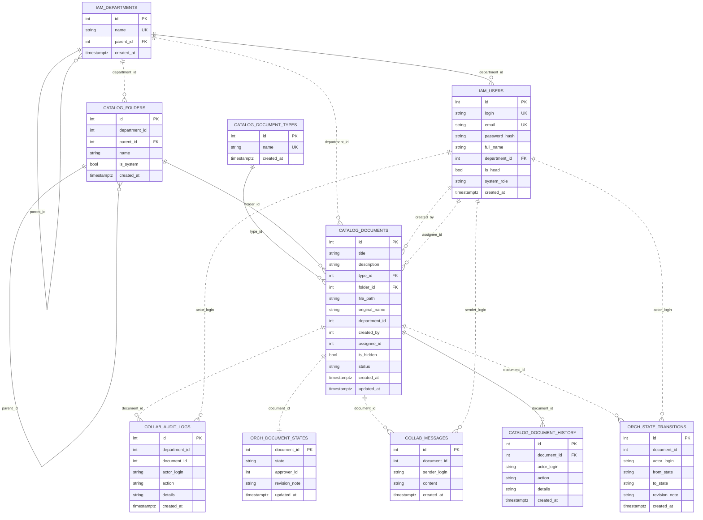

# Unified DB Schema (docflow)

This file combines all schemas from:
- docker/postgres/02_iam_tables.sql
- docker/postgres/03_catalog_tables.sql
- docker/postgres/04_collaboration_tables.sql
- docker/postgres/05_orchestrator_tables.sql

## ER Diagram (all schemas in one view)

## Notes

- Solid lines are actual SQL foreign keys inside a schema.
- Dotted lines are logical references between schemas used by services.
- Cross-schema fields are intentionally not enforced by DB-level FK in current architecture.
